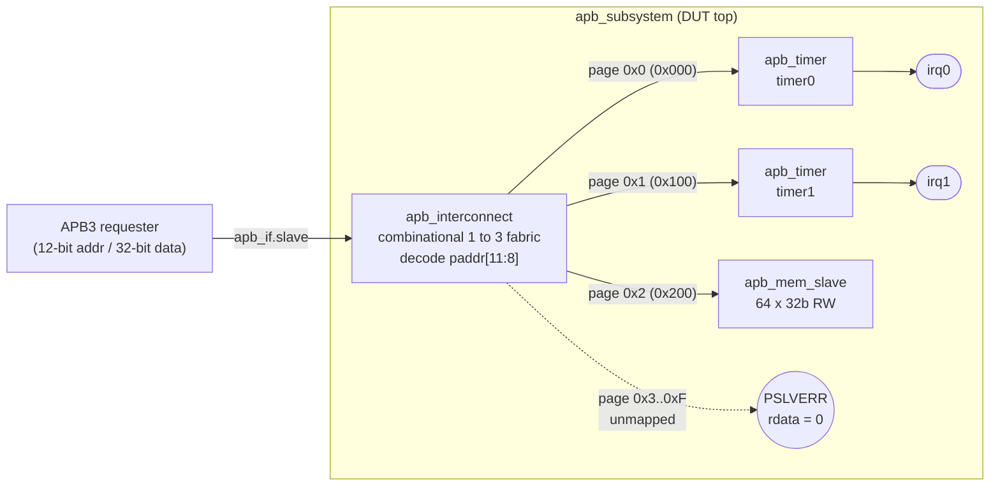
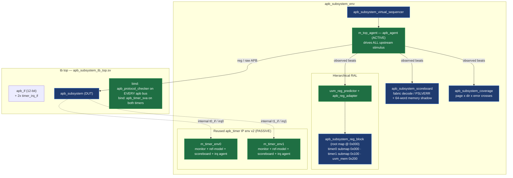

# `apb_subsystem` — Architecture Overview

A small APB3 subsystem (interconnect + two timers + a memory slave) and the UVM
environment that verifies it. The verification is built almost entirely by
**reuse** of the [`common/apb_vip`](../../../common/apb_vip) VIP and the
[`ip/apb_timer`](../../../ip/apb_timer) IP environment. Diagrams below render on
GitHub (Mermaid).

---

## 1. Hardware architecture (RTL)

### Address map (12-bit APB, decode on `paddr[11:8]`)

| Page (`paddr[11:8]`) | Base    | Slave              | Size          | On error                         |
|----------------------|---------|--------------------|---------------|----------------------------------|
| `0x0`                | `0x000` | `apb_timer` timer0 | 5 registers   | illegal reg offset → slave PSLVERR |
| `0x1`                | `0x100` | `apb_timer` timer1 | 5 registers   | illegal reg offset → slave PSLVERR |
| `0x2`                | `0x200` | `apb_mem_slave`    | 64 × 32-bit   | never errors                     |
| `0x3 … 0xF`          | —       | *(unmapped)*       | —             | fabric PSLVERR, `rdata = 0`      |

### RTL elements

| File | Element | Role |
|------|---------|------|
| `rtl/apb_interconnect.sv` | **Interconnect** | Combinational 1→3 APB fabric: decodes `paddr[11:8]`, drives **per-slave** `psel`/`penable` (each gated by its own select — a broadcast-`penable` bug here was caught by the reused protocol SVA), muxes the response back, and synthesizes PSLVERR for unmapped pages. |
| `rtl/apb_timer.sv` *(from IP)* | **timer0 / timer1** | Two unmodified instances of the `apb_timer` IP: a prescaled down-counter with one-shot/periodic modes and a sticky, maskable interrupt. |
| `rtl/apb_mem_slave.sv` | **Memory slave** | Simple single-cycle 64×32-bit APB RAM; never asserts PSLVERR. |
| `rtl/apb_subsystem.sv` | **DUT top** | Wires the interconnect to both timers + memory over a uniform 12-bit `apb_if`; exposes `irq0`/`irq1`. |

### `apb_timer` register map (each timer page)

| Offset | Register   | Access | Meaning                                   |
|--------|------------|--------|-------------------------------------------|
| `0x00` | `CTRL`     | RW     | `EN[0]`, `MODE[1]` (0=one-shot/1=periodic), `IRQ_EN[2]` |
| `0x04` | `LOAD`     | RW     | Reload / start value for the down-counter |
| `0x08` | `VALUE`    | RO     | Live counter value                        |
| `0x0C` | `STATUS`   | RW1C   | `IRQ[0]` — sticky, write-1-to-clear       |
| `0x10` | `PRESCALE` | RW     | Divisor; one tick = `PRESCALE+1` cycles   |

`irq = IRQ_EN & STATUS.IRQ`. Any other offset in `0x00..0xFF` → illegal → PSLVERR.

---

## 2. Verification environment (UVM)

> **Green = reused unchanged** (VIP agent + adapter/predictor, the two `apb_timer`
> environments, both sets of bound assertions). **Blue = the thin new subsystem
> layer.** All stimulus flows through the *single* active upstream agent; the two
> timer environments run **passive** — monitor + cycle-exact reference model +
> scoreboard + IRQ checker — bound onto the DUT's *internal* timer buses.

### UVM elements

| Component | Reused? | Role |
|-----------|---------|------|
| `m_top_agent` (`apb_agent`, **ACTIVE**) | VIP | The only driver in the system; all register, memory, and illegal-access stimulus goes through it. Its monitor feeds the predictor, scoreboard, and coverage. |
| `m_timer_env0` / `m_timer_env1` (`apb_timer_env`, **PASSIVE**) | IP env | The entire per-timer checker stack (monitor + reference-model scoreboard + IRQ agent) reused unchanged, bound to each timer's internal bus + IRQ line. Each independently proves its timer's counting/IRQ behaviour. |
| `apb_subsystem_reg_block` | new | Hierarchical register model: the `apb_timer_reg_block` reused **twice** as submaps at `0x000`/`0x100`, plus a `uvm_mem` at `0x200`. One predictor on the root map resolves everything by global offset. |
| `uvm_reg_predictor` + `apb_reg_adapter` | VIP | Keep the RAL mirror in sync from passively-monitored bus traffic. |
| `apb_subsystem_scoreboard` | new | Checks the two things the per-timer scoreboards can't see from upstream: **fabric decode / PSLVERR** and **memory contents** (64-word shadow store). |
| `apb_subsystem_coverage` | new | Decode-plan coverage: page × direction × error crosses, with `ignore_bins` for structurally-unreachable combinations (mem-never-errors, unmapped-always-errors). |
| `apb_subsystem_virtual_sequencer` + vseq lib | new | Orchestrates all traffic on the top sequencer via RAL and the reused VIP seqlib. |
| `apb_protocol_checker` (bound) | VIP SVA | AMBA-APB3 protocol assertions bound onto **every** APB bus in the design (upstream + both internal timer buses). |
| `apb_timer_sva` (bound) | IP SVA | Timer interrupt-level / deassert / sticky-STATUS assertions bound onto both timer instances. |

---

## 3. Why this is interesting (reuse story)

- **Block → SoC reuse across three axes:** the same VIP agent, the same IP
  environment (×2, passive), and the same assertions all move up unchanged; only
  a thin composition layer (hierarchical RAL + fabric/memory scoreboard +
  decode coverage) is new.
- **Assertions earned their keep on reuse:** the `apb_timer` protocol checker,
  re-bound onto the interconnect's internal buses, flagged a real fabric bug
  (`penable` broadcast to unselected slaves).
- **One uniform interface width:** because a `virtual apb_if` handle carries its
  parameter widths as part of its *type*, the whole build compiles at 12 bits via
  `+define+APB_ADDR_W=12` (see [`sim/run.f`](../sim/run.f)); the standalone IP
  build stays at the default 8 bits.

See [`REGRESSION.md`](REGRESSION.md) for the test list and how to run it.
